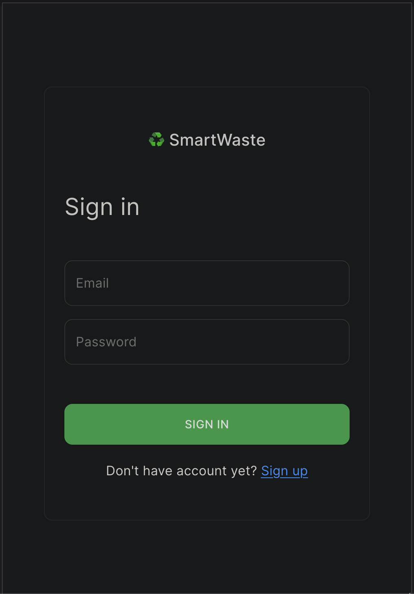
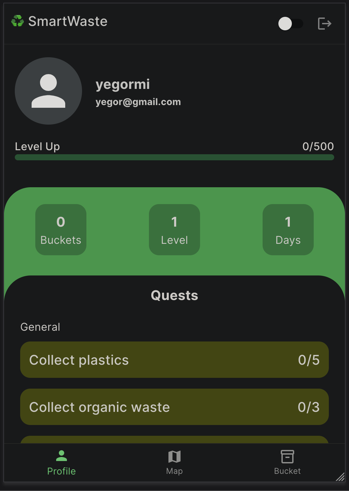
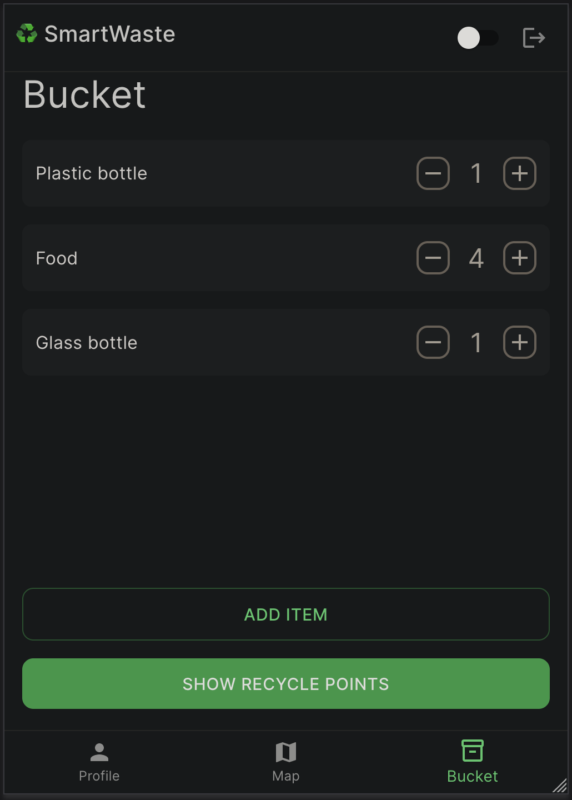

# SmartWaste for Web - README


## Screenshots

<div style="display: flex; justify-content: space-between;">
    
    
    
</div>

## Table of Contents

- [Introduction](#introduction)
- [What is SmartWaste](#what-is-smartwaste)
- [Features and Innovations](#features-and-innovations)
  - [Interactive Collection Points Map](#interactive-collection-points-map)
  - [AI for Waste Recognition](#ai-for-waste-recognition)
- [Getting Started](#getting-started)
  - [Installation](#installation)
  - [Usage](#usage)
- [Tools](#tools)
- [Contributing](#contributing)
- [License](#license)

## Introduction

Welcome to the world of SmartWaste - an innovative program designed to simplify waste sorting processes and educate users on eco-friendly habits! This document provides information on how to use the program, its features, and benefits.

## What is SmartWaste

SmartWaste is a program designed to simplify waste sorting for those lacking experience in this area. It offers an intuitive interface and incorporates gamification elements for user convenience.

## Features and Innovations

### Interactive Collection Points Map

Discover the locations of waste collection points and their functionalities using the interactive map.

### AI for Waste Recognition

Utilize modern technology for automatic waste type recognition based on photographs.

## Getting Started

Follow these instructions to get a copy of the project up and running on your local machine for development and testing purposes.

## Installation

1. Clone the repository to your local machine using Git:

```shell
 git clone https://github.com/AsTikiN/smart-waste-web
```
2. Navigate to the project directory.
3. Install dependencies:
4. Start the development server:
5. Open your web browser and visit http://localhost:3000.

## Usage

- Launch the SmartWaste app in your web browser.
- Explore the interactive map to discover waste collection points.
- Utilize the AI for waste recognition by uploading photos.
- Engage with the gamification elements to enhance the waste sorting experience.

## Tools

- React - JavaScript library for building user interfaces.
- Other relevant tools used in the project.

## Contributing

We welcome contributions from the community. If you'd like to contribute to the project, please follow our Contributing Guidelines.

## License

This project is licensed under the MIT License - see the LICENSE file for details.
